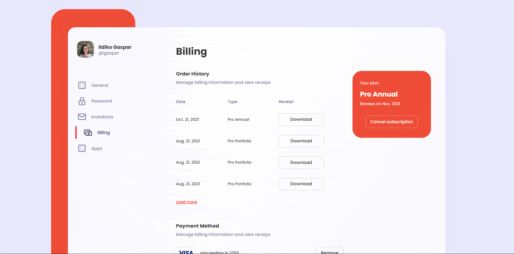
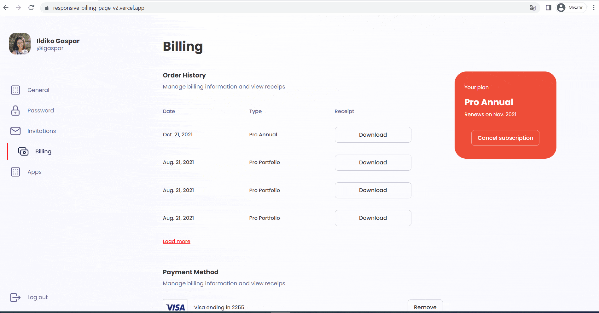

# RESPONSIVE BILLING PAGE CLONE

Normalize.css reset.css'e göre daha az müdahalecidir. Reset.css tarayıcılardaki ön tanımlı stilleri sıfırlarken(h1, p veya span etiketinin tamamen aynı özelliklere sahip olması) normalize.css html etiketlerinin ön tanımlı stillerini korumaktadır. Sıfırlamak yerine normalize eder ve bu da tasarımların farklı tarayıcılarda daha tutarlı görünmesini sağlar. Reset.css'de tüm etiketlere tekrar stil vermek ve daha fazla kod yazmaktansa, normalize.css kullanarak tutarlı, ön tanımlı, tahmin edilebilir ve hızlı bir başlangıç noktası sağlayabilmek mümkündür.

**Not: Verilen case yapısı gereği 2 farklı varyant kullandım. Her ikisinin canlı önizlemesi, screenshot ve repository adresi altta verilmiştir. İlk tasarım Figma tarzında, ikinci tasarım ise ilk tasarımın kopyası olup UI ve UX uygun hale getirilmiştir. Her iki tasarım responsive olacak şekilde hazırlanmıştır.  Zaman ayırdığınız için teşekkür ederim**

- [VARYANT-1](#VARYANT-1)
- [VARYANT-2](#VARYANT-2)

## VARYANT-1

[Canlı Önizleme](https://responsive-billing-page.vercel.app/)

### Screenshot

## VARYANT-2

[Canlı Önizleme](https://responsive-billing-page-v2.vercel.app/)

[Repository](https://github.com/serdaronculer/Responsive-Billing-Page-V2)

### Screenshot 

